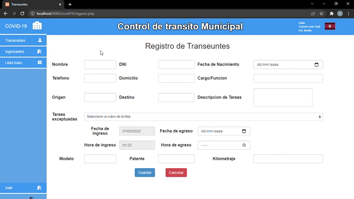

# Proyecto Control de transito Municipal

**A modo de colaboracion** Este proyecto fue desarrollado con el fin de llevar un control total del ingreso y egreso de transeuntes con sus respectivos vehiculos, desarrollado con php, mysql, js, a principios de la pandemia causada por el COVID-19.

## Instalación

Para instalar la esta aplicacion y ejecutarla deberá seguir los siguientes pasos:

 1. Clonar este repositorio ´git clone https://github.com/carloslobo09/CDTM.git´
 2. Instalar paquete Xampp
 3. Configurar Apache Server en puerto ´8080´
 4. Iniciar Apache y MySQL

## Dependencias

 1. [Bootstrap 3](https://getbootstrap.com/)
 2. [Jquery](https://https://jquery.com/)
 3. [PHP Excel](https://github.com/PHPOffice/PHPExcel)
 4. [FPDF](http://www.fpdf.org/)
 5. [XAMPP](https://www.apachefriends.org/es/index.html)

 ## Experiencia

 Colaborando con el COE local del municipio de Coronel Juan Solá, desarrolle este pequeño sistema que resolveria los problemas de controlar quienes ingresaban al pueblo y cuando debian irse para llamar la atencion gracias a los datos permitidos para cargar, en principios de la pandemia los controles eran bastante estrictos por ende le dieron un buen uso ya que les permitia extraer la informacion en documentos con extension en .pdf o .xlsx.

